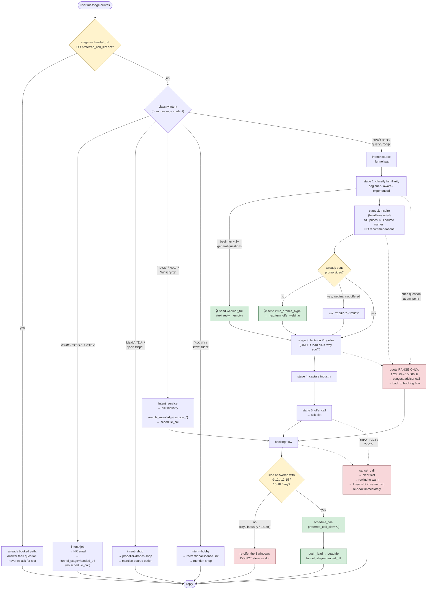

# Propeller Drones Bot — Logic & Crossroads

Two diagrams:

1. **Message lifecycle** — every path a message takes from LeadMe / WhatsApp
   through the safety nets to a reply and (optionally) a LeadMe update.
2. **Agent decision tree** — how the LLM classifies intent and moves the
   lead through the funnel stages.

Both are Mermaid so you can edit them alongside the code.

---

## 1. Message Lifecycle (inbound → agent → outbound)

```mermaid
flowchart TD
    %% ---- Inbound sources ----
    LM["📮 LeadMe webhook<br/>(new lead created)"] -->|POST /webhook/leadme/{secret}| WH[webhook/server.py]
    WA["📱 WhatsApp inbound<br/>(GreenAPI long-poll)"] --> HDL[whatsapp/handler.py]

    WH -->|first-time lead| OPN[opener.py<br/>send Hebrew intro]
    OPN -.->|no reply after N hours| FUP

    HDL -->|persist user msg<br/>tx-1| DB1[(postgres:<br/>Lead + Message)]
    HDL --> AG[agent/graph.py<br/>handle_message]

    %% ---- Agent turn ----
    AG --> CTX["load lead state,<br/>videos_sent,<br/>lead_metadata"]
    CTX --> PROMPT["render Hebrew system prompt<br/>+ 5 iron rules primacy block<br/>+ dynamic lead_state block"]
    PROMPT --> REACT{{"langgraph<br/>create_react_agent<br/>(GPT-4o)"}}

    REACT -->|tool call| TOOLS["tools.py<br/>search_knowledge / classify_lead /<br/>send_video / schedule_call / cancel_call"]
    TOOLS --> REACT
    REACT -->|final text| RAW[raw LLM reply]

    %% ---- Safety nets (post-generation) ----
    RAW --> NET1{Hebrew<br/>ratio &ge; 50%?}
    NET1 -->|no| RETRY[force-Hebrew retry]
    NET1 -->|yes| NET2{reply promises call<br/>but no schedule_call<br/>was invoked?}
    RETRY --> NET2
    NET2 -->|yes| AUTOSCHED["_enforce_booking_promise:<br/>auto-invoke mark_ready_for_call"]
    NET2 -->|no| CLEAN
    AUTOSCHED --> CLEAN[strip filler phrases]

    CLEAN --> DELAY[human-feel typing delay]
    DELAY --> SEND["whatsapp/sender.py<br/>GreenAPI send"]
    SEND -->|persist bot msg<br/>tx-2| DB2[(postgres)]

    %% ---- CRM side-effects ----
    TOOLS -.->|schedule_call succeeds| CRM["crm/leadme_client.py<br/>push_lead + status update"]
    CRM --> GUARD{"LEADME_TEST_MODE<br/>OR phone starts 999?"}
    GUARD -->|yes| NOOP["🚫 no-op<br/>(log only)"]
    GUARD -->|no| LMAPI["LeadMe supplier API<br/>insert + update"]

    %% ---- Follow-up + admin ----
    FUP["followup/scheduler.py<br/>APScheduler every 30m"] -->|silent leads| HDL
    ADM["admin/routes.py<br/>/admin (basic auth)"] --> DB1
    ADM -.->|delete lead| LMDEL["crm/leadme_delete.py<br/>search-by-phone → POST deleteLeads<br/>(uses saved cookies + CSRF)"]

    classDef safety fill:#fff3cd,stroke:#856404
    classDef guard fill:#f8d7da,stroke:#721c24
    classDef ext fill:#d1ecf1,stroke:#0c5460
    class NET1,NET2,CLEAN,DELAY,AUTOSCHED,RETRY safety
    class GUARD,NOOP guard
    class LM,WA,CRM,LMAPI,LMDEL,REACT ext
```

---

## 2. Agent Decision Tree (per turn)



---

## Legend

- **Blue** — external system boundaries (LeadMe, WhatsApp, LLM).
- **Yellow** — safety nets and validation gates in the code path.
- **Red** — hard guards / no-ops (test-mode, phone-prefix, non-canonical slots).
- **Green** — success terminal states (booking pushed, video sent).

## Key files referenced

| Node | File |
|---|---|
| Webhook | `app/webhook/server.py` |
| Opener | `app/webhook/opener.py` |
| WhatsApp handler | `app/whatsapp/handler.py`, `app/whatsapp/sender.py` |
| Agent loop | `app/agent/graph.py` |
| Prompt | `app/agent/prompts.py` |
| Tools | `app/agent/tools.py` |
| CRM push | `app/crm/leadme_client.py` |
| CRM delete | `app/crm/leadme_delete.py` |
| Follow-ups | `app/followup/scheduler.py` |
| Admin UI | `app/admin/routes.py` |
